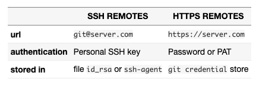

# golden-retriever

There are three main packages in golden-retriever:

## 1. [retriever](./retriever)

Retrieve file content from remote git repositories with given git reference.

```
type Retriever interface {
	Retrieve(ctx context.Context, resource *Resource) (content []byte, err error)
}
```

[`git`](./retriever/git) is an implementation of `Retriever` interface. It clones and fetches remote repository via [git](https://git-scm.com/). And caches repositoies in memory, or filesystem if specified.

All git authentication methods are supported:




## 2. [pinner](./pinner)

An implementation of `Retriever` interface. On top of simply retrieving remote file content, it pinned the commit hash of given reference. It uses the pinned commit hash next time retrieving the same repository and reference rather than resolve it again.


## 3. [reader](./reader)

Read local (and remote) file content.

```
type Reader interface {
	Read(context.Context, string) ([]byte, error)
	ReadHash(context.Context, string) ([]byte, retriever.Hash, error)
	ReadHashBranch(context.Context, string) ([]byte, retriever.Hash, string, error)
}
```

There are two implementation of the `Reader` interface:
1. [`filesystem`](./reader/filesystem): support read local files from filesystem.
2. [`remotefs`](./reader/remotefs): support read both local and remote files via filesystem and retriever separately.
